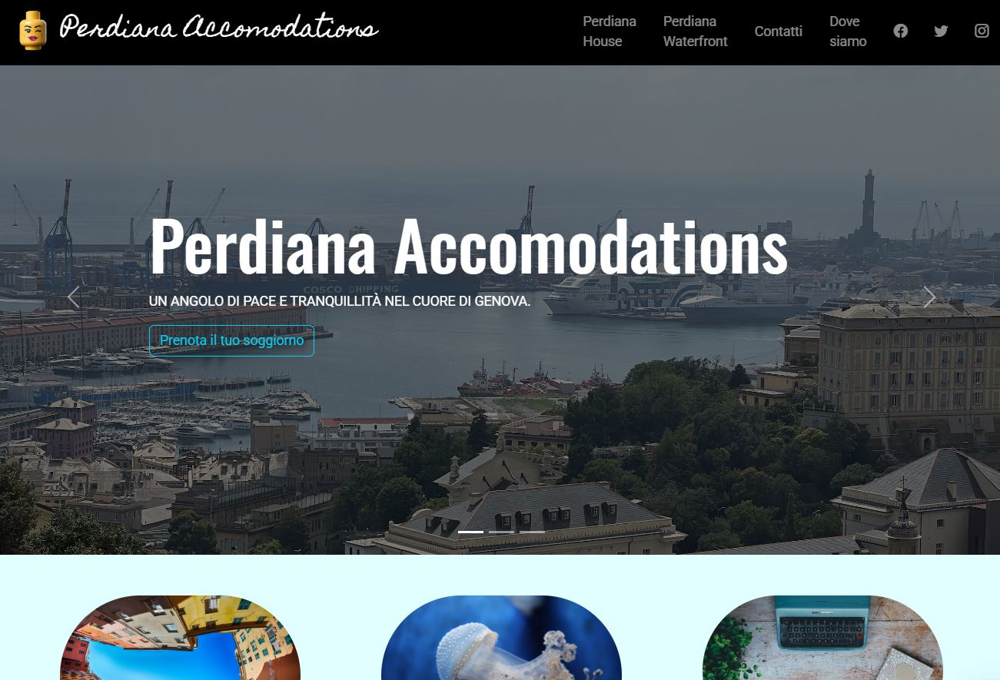

[](https://opensource.org/licenses/MIT)
[](https://developer.mozilla.org/en-US/docs/Web/Guide/HTML/HTML5)
[](https://developer.mozilla.org/en-US/docs/Web/CSS/CSS3)
[](https://www.javascript.com/)
[](https://getbootstrap.com/)

# 🏨 Perdiana Accomodations - Sito Web

**Sito web statico per Perdiana Accomodations, che offre alloggi in affitto a Genova. Presenta le proprietà Perdiana House e Perdiana Waterfront, informazioni di contatto e mappa.**



## ✨ Descrizione

Questo progetto è un sito web statico sviluppato utilizzando HTML5, CSS3 e JavaScript, con il framework Bootstrap 5 per uno styling responsivo e moderno. L'obiettivo del sito è presentare Perdiana Accomodations, un'attività di affitti brevi a Genova, mostrando le due proprietà principali (Perdiana House e Perdiana Waterfront), fornendo informazioni di contatto utili e indicando la posizione tramite una mappa integrata.

## 🚀 Caratteristiche Principali

* **Slideshow:** Una galleria di immagini dinamica per mostrare le proprietà, completa di didascalie e inviti all'azione.
* **Presentazione Alloggi:** Sezioni dedicate con descrizioni dettagliate e immagini di Perdiana House e Perdiana Waterfront.
* **Informazioni di Contatto:** Una sezione chiara e accessibile con il numero di telefono e l'indirizzo email per contattare Perdiana Accomodations.
* **Mappa:** Integrazione di Google Maps per visualizzare la posizione degli alloggi a Genova.
* **Integrazione Social Media:** Link diretti alle pagine social di Perdiana Accomodations su Facebook, Twitter e Instagram.
* **Ottimizzazione SEO:** Implementazione di meta tag strategici per migliorare la visibilità sui motori di ricerca.
* **Design Responsivo:** Il layout del sito si adatta perfettamente a diverse dimensioni di schermo, garantendo un'esperienza utente ottimale su desktop, tablet e dispositivi mobili.

## 🛠️ Tecnologie Utilizzate

* **Frontend:**
    * **HTML5:** Linguaggio di markup standard per la struttura del sito web.
    * **CSS3:** Utilizzato per lo styling e l'aspetto visivo del sito.
    * **JavaScript:** Per funzionalità interattive come lo slideshow.
    * **[Bootstrap 5](https://getbootstrap.com/)**: Framework CSS per la creazione di un layout responsivo e componenti predefiniti.
    * **[Google Maps Embed API](https://developers.google.com/maps/documentation/embed/get-started)**: Per integrare la mappa della posizione.

## ⚙️ Come Avviare il Sito Localmente

1. **Clona il repository** (se il codice è ospitato su una piattaforma come GitHub):
   ```bash
   git clone <URL_del_repository>

**Realizzato con ❤️ e codice da davide017017**
 
